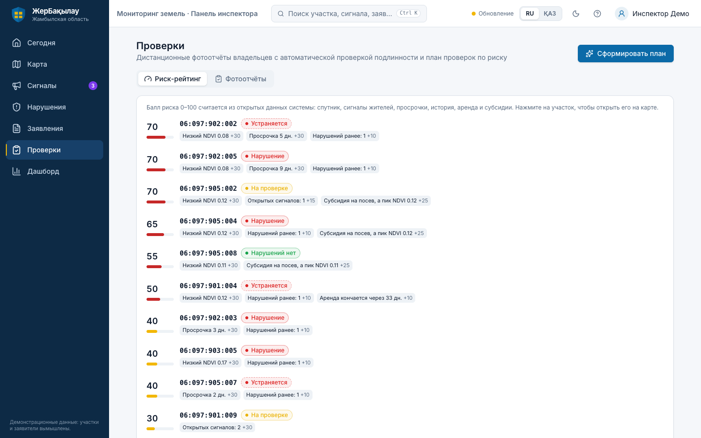
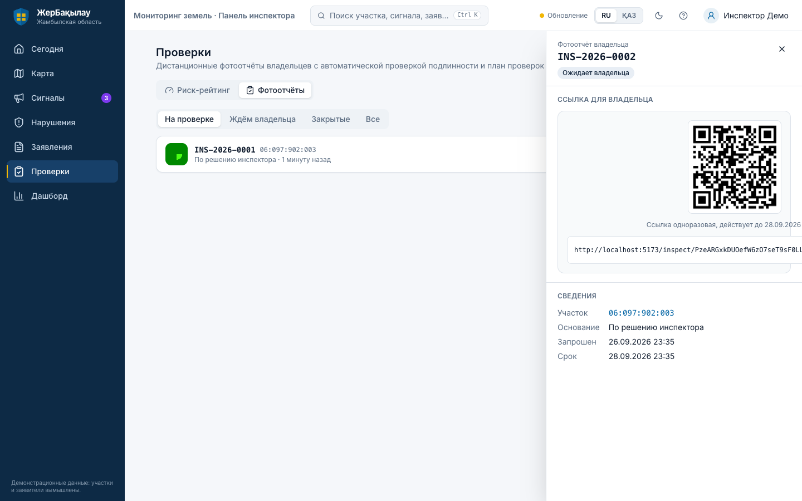
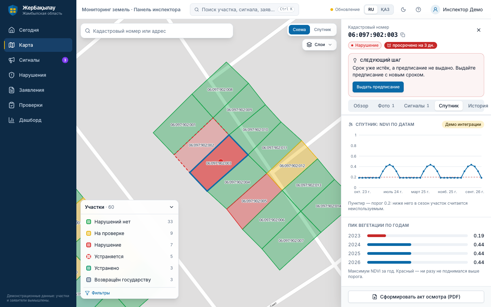
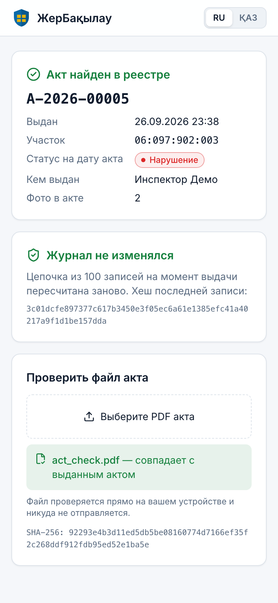
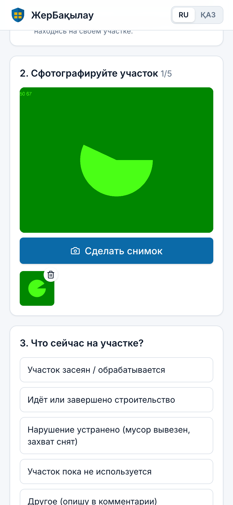
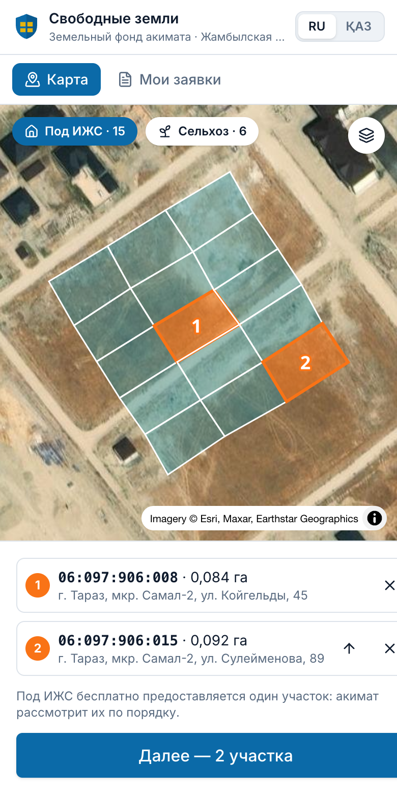
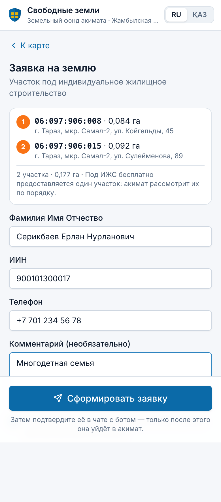
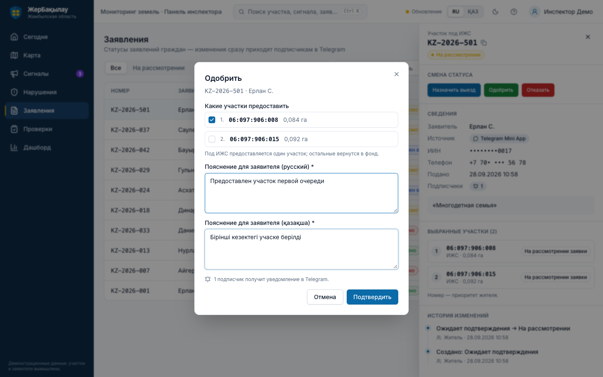

# ЖерБақылау

**Цифровой земельный контроль для акиматов Казахстана.** Инспектор видит все участки района на карте, сигналы жителей приходят в реальном времени, спутник сам находит неиспользуемые земли. Ни владелец, ни служащий не могут незаметно подделать результат проверки.

> **Прод:** панель — https://jer-baqylau.vercel.app · API — https://jer-api-production.up.railway.app ([/docs](https://jer-api-production.up.railway.app/docs)) · бот — [@take_a_place_bot](https://t.me/take_a_place_bot)
>
> Передаёте проект другому разработчику? Начните с **[docs/HANDOFF.md](docs/HANDOFF.md)**.

## Вход в панель

| Среда | Адрес | Логин | Пароль |
|---|---|---|---|
| Прод | https://jer-baqylau.vercel.app | `inspector@jer.kz` | `nXiB6uJo1sP4tx0y` |
| Локально | http://localhost:5173 | `inspector@jer.kz` | `demo12345` |

Бот для граждан без входа: [@take_a_place_bot](https://t.me/take_a_place_bot). Страницы `/inspect/…` (фотоотчёт владельца) и `/verify/…` (проверка акта) тоже открываются без входа.

> Это демо-учётка инспектора. Если репозиторий станет публичным, смените пароль (Supabase → Authentication → Users) и уберите его отсюда.

---

## Какую проблему решаем

| Проблема сегодня | Что делает ЖерБақылау |
|---|---|
| Инспекторы вручную объезжают участки и ведут бумажные журналы | GIS-карта всех участков со статусами, сроками и историей; спутник Sentinel-2 сам отмечает кандидатов на неиспользование |
| Граждане не знают статус своего заявления и какие нужны документы | Telegram-бот на русском и казахском: статус по номеру, подписка на изменения, пошаговые инструкции по услугам |
| Гражданин не знает, какая земля свободна, и подаёт заявление вслепую | **Telegram Mini App «Свободные земли»**: карта земельного фонда акимата, выбор одного или нескольких участков, заявка с подтверждением в Telegram — сразу в панели акимата |
| Нет простого способа сообщить о свалке или самозахвате | «Народный контроль» в боте: фото + точка → сигнал за секунды появляется на карте инспектора, житель получает ответ |
| Владелец может прислать старое фото или получить субсидию на несуществующий посев | Фотоотчёт только с камеры, на участке, с GPS и автоматической проверкой подлинности; сверка субсидий со спутником |
| Служащий может «закрыть» нарушение без выезда или поправить историю | «Устранено» только с доказательством; журнал в цепочке хешей; акт с QR-кодом проверки; план проверок по риску и честной случайной выборке |

## Сквозной цикл

```
Житель (Telegram)          Сервер (FastAPI + PostGIS)           Инспектор (веб-панель)
─────────────────          ──────────────────────────           ──────────────────────
фото + точка ─────────────▶ привязка к участку (ST_Contains),
                            объединение дублей в 30 м ─────────▶ сигнал на карте без перезагрузки
                                                                 подтвердить → нарушение, срок
уведомление на KZ/RU ◀───── событие + outbox ◀────────────────── предписание → устранено (с доказательством)
                                                                 PDF-акт с QR → любой может проверить
```

## Скриншоты

| Карта участков | Карточка участка | Сигнал жителя в реальном времени |
|---|---|---|
|  |  |  |
| **Риск-рейтинг и план проверок** | **Фотоотчёт владельца: проверки подлинности** | **Спутник: NDVI за 3 года** |
|  |  |  |
| **Дашборд и целостность журнала** | **Проверка акта по QR (телефон)** | **Фотоотчёт владельца (телефон)** |
|  |  |  |
| **Mini App: выбор свободных участков** | **Mini App: заявка** | **Панель: одобрение заявки** |
|  |  |  |

---

## Функции

### 1. Веб-панель инспектора (`apps/web`)

- **«Сегодня»**: стартовая страница с тем, что требует внимания: новые сигналы, просроченные сроки, заявления на решении.
- **Карта** (MapLibre): участки окрашены по статусам, подложка «схема» или «спутник», пульсирующие сигналы с кластеризацией, легенда со счётчиками, фильтры, поиск по кадастровому номеру и адресу, слой NDVI.
- **Карточка участка**, вкладки:
  - «Обзор»: жизненный цикл, подсказка «Следующий шаг», характеристики, срок устранения, земельный фонд («Предложить гражданам»), фотоотчёты владельца, сверка с госданными, выписка ГБД ЗКС;
  - «Фото»: загрузка перетаскиванием, GPS из EXIF;
  - «Сигналы»: связанные обращения жителей;
  - «Спутник»: график NDVI за 3 года с порогом, пики по годам, снимки «до/после»;
  - «История»: журнал всех действий.
- **Жизненный цикл нарушения**: `Нарушений нет → На проверке → Нарушение → Устраняется → Устранено / Возвращён государству`. Строгая машина состояний, обязательный комментарий, сроки с обратным отсчётом.
- **Сигналы** жителей: фото, мини-карта, «N жителей сообщили», подтвердить или отклонить. Решение каскадом применяется к дублям.
- **Нарушения**: список со сроками и просрочками. **Заявления**: решения с пояснением на RU и KZ; заявки из Mini App — с выбранными участками по приоритету и выбором, какие предоставить.
- **Проверки** (антифрод):
  - риск-рейтинг участков с объяснением баллов;
  - план проверок: часть по риску, часть по воспроизводимой случайной выборке;
  - фотоотчёты владельцев с вердиктом, картой точки съёмки и решением инспектора.
- **Дашборд**: KPI, графики, ближайшие сроки, индикатор «Журнал цел».
- **PDF-акт осмотра** (RU/KZ) с данными участка, фото, реестровым номером и QR-кодом проверки. Экспорт GeoJSON и CSV.
- **Удобство**: интерактивные туры, справка (`?`), поиск по всему (`Ctrl+K`), тёмная тема, переключение RU/KZ, индикатор realtime.

### 2. Страницы без входа (для граждан и владельцев)

- **`/app`**: Telegram Mini App «Свободные земли» (см. п. 3). Вне Telegram карта открывается для просмотра, подать заявку можно только из бота.
- **`/inspect/:token`**: фотоотчёт владельца с телефона; внутри Telegram открывается как Mini App. Снимать можно только камерой (галерея недоступна), телефон передаёт GPS с точностью, владелец отвечает «что сейчас на участке» и может оставить комментарий. Интерфейс RU/KZ.
- **`/verify/:id`**: проверка акта по QR. Показывает данные из реестра, целостность журнала на дату акта и сверяет PDF по SHA-256 прямо в браузере (файл никуда не отправляется).

### 3. Telegram Mini App «Свободные земли» (`/app`)

Сквозной цикл предоставления земли без бумажного заявления:

1. **Акимат** выставляет государственные участки в **земельный фонд** (в демо — 15 участков под ИЖС в мкр. Самал-2 и 6 полей у с. Бурыл; кнопка «Предложить гражданам» есть у любого госучастка, в том числе возвращённого государству).
2. **Житель** открывает в боте «🗺 Свободные земли» (или кнопку меню чата) → карта на спутниковой подложке → выбирает **один или несколько участков**; порядок нажатия = приоритет.
3. Заполняет ФИО, ИИН (проверяется контрольная цифра), телефон → «Сформировать заявку».
4. **Бот присылает сводку** с кнопками «✅ Подтвердить и отправить» / «✖️ Отменить». Только после подтверждения участки бронируются, а заявка **сразу появляется в панели акимата** (всплывающее уведомление со звуком).
5. **Акимат** в разделе «Заявления» видит выбранные участки по приоритету и маскированные данные заявителя, одобряет — и отмечает, какие участки предоставить (ИЖС — один, сельхоз — можно несколько, аренда на 10 лет). Остальные возвращаются в фонд.
6. Участок закрепляется за жителем **вместе с его Telegram**. Когда инспектор запрашивает фотоотчёт, ссылка **сразу приходит владельцу в чат** кнопкой Mini App — открывается проверка, которая сразу просит геолокацию (через Telegram LocationManager) и камеру. **QR не нужен.** Решение по отчёту тоже приходит в чат.

Безопасность: личность подтверждается подписью Telegram (`initData`, HMAC от токена бота), без логина и пароля; в БД хранятся только маскированные ИИН и телефон.

### 4. Telegram-бот для граждан (`apps/api/app/bot`)

- Только кнопки, язык выбирается при старте (Қазақша / Русский).
- **«🗺 Свободные земли»**: открывает Mini App (п. 3), подтверждение и отмена заявки прямо в чате.
- **Статус заявления**: `kz 2026 42` → `KZ-2026-042`, прогресс по этапам, подписка на изменения.
- **База знаний**: три процедуры (участок под ИЖС, изменение целевого назначения, продление договора аренды) с документами и шагами.
- **«Народный контроль»**: категория, точка (геолокация или координаты), 1–5 фото, описание. В ответ приходит трек-номер `SIG-…`.
- **«Мои обращения»** и уведомления на языке жителя на каждом этапе.

### 5. Спутниковый мониторинг (реальные данные)

- Снимки Sentinel-2 L2A из открытого каталога Earth Search (AWS). NDVI считается по пикселям внутри полигона, облака и тени исключаются по SCL. Автоматический скан раз в 6 часов.
- История участка за 36 месяцев: лучший безоблачный снимок каждого месяца, пики по годам, RGB-снимки «сейчас / год назад / два года назад» с контуром участка.
- Кандидаты на неиспользование (NDVI в сезон ниже 0.2) попадают в риск-рейтинг.

### 6. Защита от обмана и злоупотреблений

| Кто может обмануть | Как | Защита |
|---|---|---|
| Владелец | Прислать старое или чужое фото | Только камера, время съёмки ≤ 20 мин, телефон на участке (PostGIS, допуск по точности GPS), уникальность по перцептивному хешу против всех фото системы |
| Владелец | Заявить посев ради субсидии | Сверка реестра субсидий с пиком NDVI за май–август; расхождение повышает риск участка |
| Служащий | «Закрыть» нарушение без выезда | `RESOLVED` только при доказательстве после предписания: фото инспектора с GPS, принятый отчёт владельца или спутник. Иначе `422 EVIDENCE_REQUIRED` |
| Служащий | Поправить или удалить историю | Журнал `status_transitions` связан цепочкой SHA-256; `GET /audit/verify` пересчитывает её; индикатор на дашборде |
| Кто угодно | Подделать акт | Реестр актов с SHA-256 PDF и головой цепочки; QR → `/verify/:id` |
| Служащий | Проверять «не тех» | План по баллу риска плюс случайная выборка с зерном `sha256(дата:голова журнала)`, которое записывается в журнал и пересчитывается кем угодно |

Подробнее: [docs/ARCHITECTURE.md → «Целостность и защита от обмана»](docs/ARCHITECTURE.md).

### 7. Что работает на реальных данных, а что демо

| Компонент | Статус |
|---|---|
| PostGIS, машина состояний, бот, realtime, уведомления, PDF, антифрод, журнал | Работает полностью |
| Спутник Sentinel-2 | **Реальные снимки** (провайдер `sentinel`), есть офлайн-режим `mock` |
| Участки, заявления, жители | Вымышленные (окрестности Тараза, кадастровые номера из фиктивного диапазона `06:097:9xx`) |
| Земельный фонд (свободные участки) | Демо-участки; в продакшене — выгрузка из ГБД ЗКС / решения акимата |
| ГБД ЗКС, реестр субсидий | Демо-адаптеры с тем же интерфейсом; в интерфейсе помечены «Демо интеграции». Настоящие подключаются через ШЭП |
| Вход инспектора | Supabase Auth (email + пароль); в плане — ЭЦП через NCALayer |

---

## Стек

| Слой | Технологии |
|---|---|
| API + бот | Python 3.12, FastAPI, SQLAlchemy 2 (async) + GeoAlchemy2, Alembic, Pydantic v2, aiogram 3, APScheduler, structlog, Fluent (i18n), reportlab, Pillow, rasterio |
| БД | PostgreSQL 15 + PostGIS (Supabase на проде, Docker локально) |
| Web | React 18, TypeScript (strict), Vite, MapLibre GL, Tailwind v4, Radix, TanStack Query, Zustand, i18next, recharts |
| Инфраструктура | Supabase (БД, Auth, Storage, Realtime), Railway (API + бот + планировщик), Vercel (веб), Upstash Redis (FSM бота, блокировки задач) |
| Качество | pytest (87 тестов, отдельная тестовая БД PostGIS), vitest, ruff, mypy, eslint, e2e smoke-скрипт |

## Архитектура кратко

```
apps/api          FastAPI + aiogram-бот + APScheduler (один процесс)
  app/api         роуты (тонкие)            app/services   бизнес-логика (общая для API и бота)
  app/domain      enum'ы, машина состояний, цепочка хешей
  app/providers   адаптеры: cadastre, satellite (Sentinel-2), registry (субсидии), notification, storage
  app/bot         хендлеры, клавиатуры, FSM  app/locales    Fluent RU/KZ (бот, уведомления, акт)
  app/workers     спутниковый скан          migrations      Alembic
apps/web          React-панель + публичные страницы /inspect, /verify
  src/api         клиент + сгенерированный schema.d.ts (руками не редактировать)
packages/seed     участки (GeoJSON), заявления, сигналы, база знаний
supabase          SQL: RLS, Realtime, Storage
scripts           seed, demo_reset, e2e_smoke, gen_types, set_webhook, create_inspector
docs              план, решения (ADR), архитектура, API, деплой, демо, дорожная карта, передача проекта
```

Правила проекта (язык, зоны ответственности, соглашения) лежат в [CLAUDE.md](CLAUDE.md), решения — в [docs/DECISIONS.md](docs/DECISIONS.md).

## Быстрый старт (локально)

Нужны Docker, [uv](https://docs.astral.sh/uv/) и Node.js 20+.

```bash
make setup          # зависимости + .env из .env.example
make up             # PostGIS + Redis + API в Docker; миграции и сид выполнятся сами
make dev-web        # панель: http://localhost:5173  (inspector@jer.kz / demo12345)
```

API: http://localhost:8000, документация OpenAPI: http://localhost:8000/docs. Локально спутник по умолчанию в режиме `mock`, а бот выключен (`BOT_MODE=disabled`). Токен бота общий с продом, поэтому включать его локально нельзя, иначе он перехватит вебхук.

**Windows**: WSL2 + Docker Desktop, команды те же. Без make: `Copy-Item .env.example .env; docker compose up -d --build; cd apps/web; npm ci; npm run dev`. Эквиваленты всех целей Makefile перечислены в `CLAUDE.md`.

## Команды разработки

```bash
make db             # только PostGIS + Redis
make dev-api        # API на хосте с hot reload
make test           # pytest + vitest
make lint           # ruff, mypy, eslint
make gen-types      # OpenAPI → apps/web/src/api/schema.d.ts (после любого изменения схем/роутов)
make e2e            # сквозной smoke-тест против запущенного API
make demo-reset     # вернуть демо-данные в исходное состояние
make check          # всё, что проверяет CI
```

Против прода скрипты запускаются с `JER_ENV_FILE=.env.production` и `--base-url https://jer-baqylau.vercel.app`, подробности в [docs/DEPLOY.md](docs/DEPLOY.md).

## Документация

| Документ | О чём |
|---|---|
| [docs/HANDOFF.md](docs/HANDOFF.md) | **Передача проекта**: доступы, секреты, первый день, подводные камни |
| [docs/ARCHITECTURE.md](docs/ARCHITECTURE.md) | Схема системы, сквозной цикл, интеграции с госсистемами, безопасность, антифрод |
| [docs/DECISIONS.md](docs/DECISIONS.md) | Архитектурные решения (ADR) и что требует сверки |
| [docs/API.md](docs/API.md) | Эндпоинты и формат ошибок |
| [docs/DEPLOY.md](docs/DEPLOY.md) | Пошаговый деплой Supabase + Railway + Vercel + Upstash |
| [docs/DEMO_SCRIPT.md](docs/DEMO_SCRIPT.md) | Сценарий демо на 3 минуты + блок «Честность» |
| [docs/ROADMAP.md](docs/ROADMAP.md) | **План развития** по этапам |
| [docs/PLAN.md](docs/PLAN.md) | Исходный план разработки по фазам |

## Данные и оговорки

Все участки, заявления и имена вымышлены. Нормативный контент бота требует сверки с актуальным регламентом, а казахские тексты — вычитки носителем языка (см. `docs/DECISIONS.md`).
