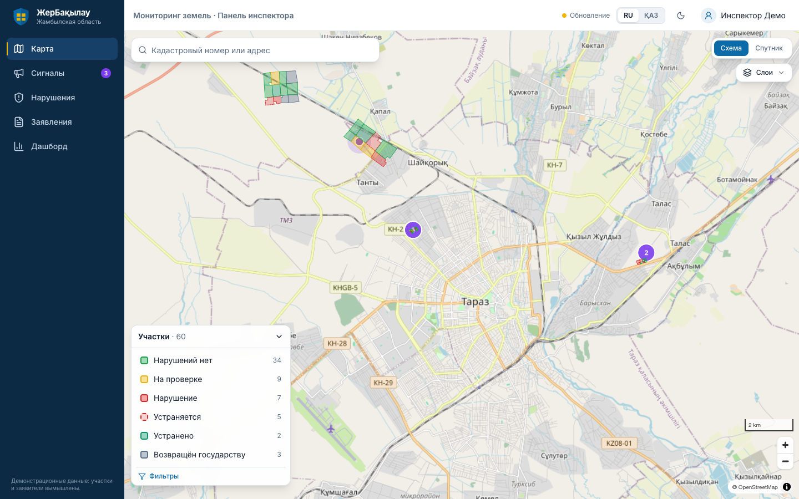
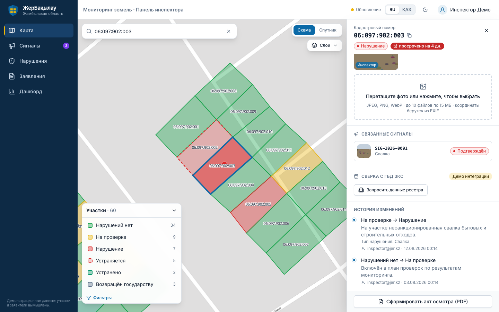
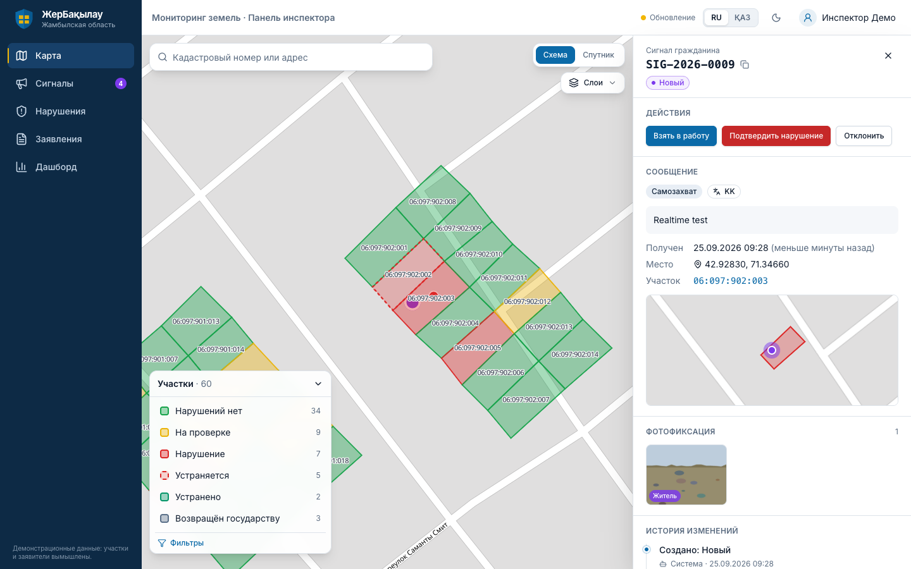
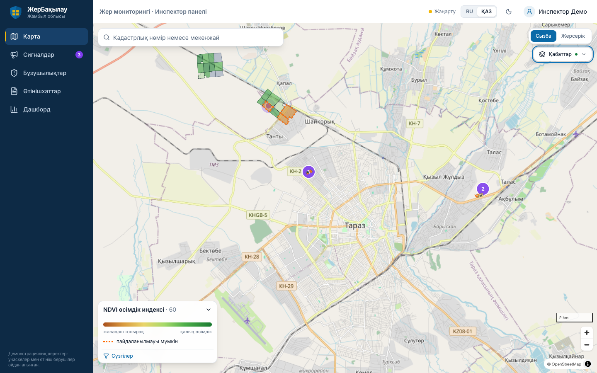
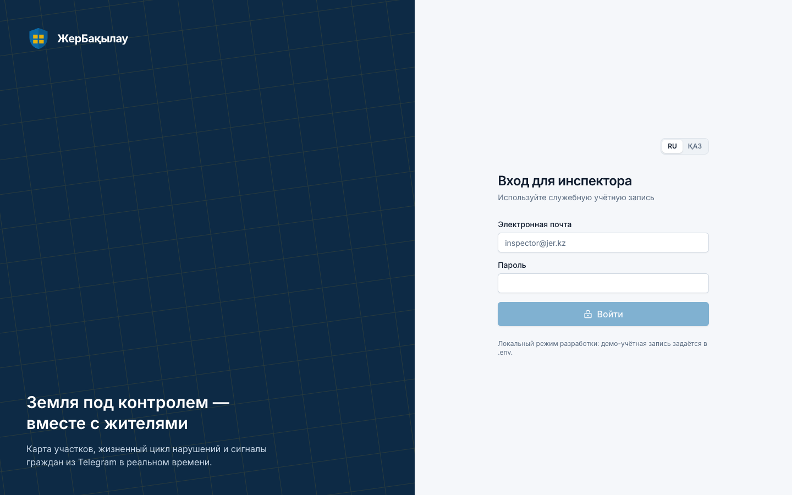

# ЖерБақылау

Цифровой мониторинг земель, двусторонний сервис:

- **Веб-панель инспектора**: GIS-карта участков, жизненный цикл нарушений, фотофиксация, дедлайны, дашборд, спутниковый NDVI-слой.
- **Telegram-бот для граждан**: статус заявлений, база знаний, «Народный контроль» с геолокацией и фото. Интерфейс на русском и казахском.

Сквозной цикл: житель отправляет фото и точку → сигнал мгновенно появляется на карте → инспектор меняет статус → житель получает уведомление на своём языке.

> **Прод:** панель — https://jer-baqylau.vercel.app · API — https://jer-api-production.up.railway.app ([/docs](https://jer-api-production.up.railway.app/docs)) · бот — [@take_a_place_bot](https://t.me/take_a_place_bot)

| Карта участков | Карточка участка | Сигнал жителя в реальном времени |
|---|---|---|
|  |  |  |
| **Дашборд** | **NDVI-слой, интерфейс на казахском** | **Вход** |
|  |  |  |

## Возможности

- **Карта инспектора**: участки по статусам (MapLibre, схема/спутник), пульсирующие сигналы с кластеризацией, легенда со счётчиками, фильтры, поиск по кадастровому номеру и адресу.
- **Жизненный цикл нарушения**: `Выявлено → Устраняется → Устранено / Возвращено государству`. Строгая машина состояний, обязательный комментарий, журнал аудита, дедлайны с обратным отсчётом.
- **«Народный контроль»**: фото и точка из Telegram. Привязка к участку через PostGIS (`ST_Contains`, иначе ближайший в 100 м), объединение дублей в радиусе 30 м за 7 дней («N жителей сообщили»).
- **Realtime**: Supabase `postgres_changes`, при сбое — автоматический поллинг. Toast со звуком.
- **Уведомления жителю на его языке** на каждом этапе, подписка на статус заявления.
- **Бот только на кнопках**: статус заявления (`kz 2026 42` → `KZ-2026-042`), база знаний по трём процедурам, «Мои обращения».
- **PDF-акт осмотра** (RU/KZ), экспорт GeoJSON/CSV, дашборд KPI.
- **Спутниковый мониторинг**: реальный NDVI по снимкам Sentinel-2 L2A (ESA Copernicus) для каждого участка, облака исключены, кандидаты на неиспользование.
- **Удобство**: страница «Сегодня», интерактивное обучение, справка, поиск Ctrl+K, подсказка «Следующий шаг».
- **Масштабирование**: адаптеры ГБД ЗКС, SMS / eGov mobile. См. `docs/ARCHITECTURE.md` и [дорожную карту](docs/ROADMAP.md).

Документы: [план](docs/PLAN.md) · [решения](docs/DECISIONS.md) · [архитектура](docs/ARCHITECTURE.md) · [API](docs/API.md) · [деплой](docs/DEPLOY.md) · [сценарий демо](docs/DEMO_SCRIPT.md) · [дорожная карта](docs/ROADMAP.md)

## Стек

| Слой | Технологии |
|---|---|
| API + бот | Python 3.12, FastAPI, SQLAlchemy 2 (async) + GeoAlchemy2, Alembic, Pydantic v2, aiogram 3, APScheduler |
| БД | PostgreSQL 15 + PostGIS (Supabase на проде, Docker локально) |
| Web | React 18, TypeScript, Vite, MapLibre GL, Tailwind, TanStack Query, Zustand, i18next |
| Инфраструктура | Supabase (БД, Auth, Storage, Realtime), Railway (API + бот), Vercel (web), Upstash Redis (FSM бота) |

## Быстрый старт

Нужны Docker, [uv](https://docs.astral.sh/uv/) и Node.js 20+.

### macOS / Linux

```bash
make setup          # зависимости + .env из .env.example
make up             # PostGIS + Redis + API в Docker; миграции и сид выполнятся сами
make dev-web        # панель: http://localhost:5173  (inspector@jer.kz / demo12345)
```

API: http://localhost:8000, документация OpenAPI: http://localhost:8000/docs.

### Windows

Рекомендуется WSL2 + Docker Desktop (интеграция с WSL включена). Внутри WSL команды те же, что для macOS.
Без WSL и make (PowerShell):

```powershell
Copy-Item .env.example .env
docker compose up -d --build
cd apps/web; npm ci; npm run dev
```

Все цели Makefile имеют эквивалент без make, таблица команд — в `CLAUDE.md`.

## Разработка

```bash
make db             # только PostGIS + Redis
make dev-api        # API на хосте с hot reload
make test           # pytest + vitest
make lint           # ruff, mypy, eslint, prettier
make gen-types      # OpenAPI → apps/web/src/api/schema.d.ts
make e2e            # сквозной smoke-тест цикла против запущенного API
make demo-reset     # вернуть демо-данные в исходное состояние
```

## Структура

```
apps/api        FastAPI + Telegram-бот + планировщик
apps/web        React-панель инспектора
packages/seed   участки (GeoJSON), заявления, сигналы, база знаний, импорт данных организаторов
supabase        SQL: RLS, Realtime, Storage
scripts         кроссплатформенные скрипты (сид, сброс, e2e, генерация типов, вебхук)
docs            план, решения, архитектура, деплой, сценарий демо
```

## Данные

Все участки, заявления и имена вымышлены. Регион — окрестности Тараза (Жамбылская область). Нормативный контент бота требует сверки с актуальным регламентом, казахские тексты — вычитки носителем языка (`docs/DECISIONS.md`).
