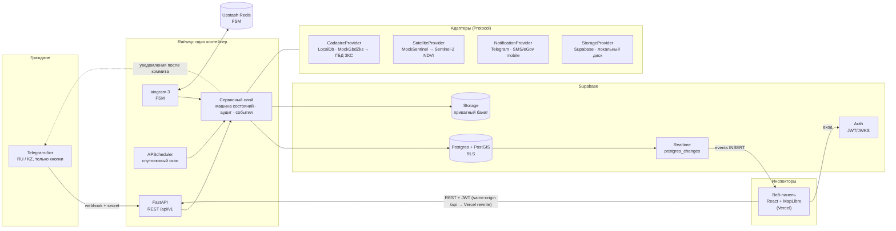
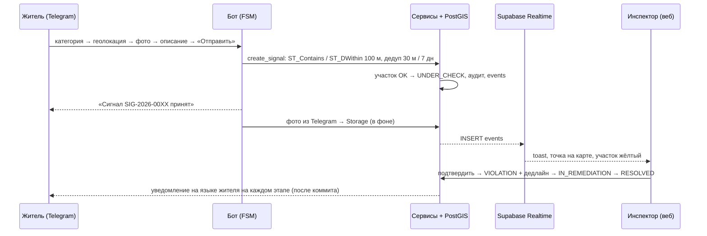

# Архитектура «ЖерБақылау»

## Обзор

## Сквозной цикл

## Слои кода

| Слой | Где | Ответственность |
|---|---|---|
| Домен | `app/domain` | enum'ы, **машина состояний** (единственный источник допустимых переходов), трек-номера |
| Сервисы | `app/services` | бизнес-логика, транзакции, аудит, события, уведомления; общие для API, бота и планировщика |
| Адаптеры | `app/providers` | внешние системы за `Protocol`-интерфейсами |
| Транспорт | `app/api`, `app/bot` | тонкие HTTP-роуты и хендлеры бота |
| Данные | `app/db`, `migrations` | SQLAlchemy 2 + GeoAlchemy2, Alembic |

Ключевые свойства:
- **Геоданные только в PostGIS** (SRID 4326, GiST-индексы); площади и расстояния — через `::geography`.
- **Аудит**: каждая смена статуса пишет `status_transitions` и `events` в той же транзакции.
- **Уведомления после коммита** (`outbox.after_commit`): откат транзакции — сообщение не уходит.
- **Идемпотентность**: обработанные `update_id` Telegram хранятся в БД; сид и сброс демо — под advisory lock.

## Подключение реальных государственных систем

| Интеграция | Сейчас | Путь к продакшену |
|---|---|---|
| **ГБД ЗКС** (земельный кадастр) | `MockGbdZksProvider` — детерминированный ответ реестра, расхождения площади | Реализовать `CadastreProvider` поверх API ГБД ЗКС через **ШЭП** (шлюз электронного правительства); синхронизация участков по кадастровым номерам, ночная сверка геометрий, таблица расхождений для инспектора |
| **egov.kz / ЕСЭДО** (заявления) | Заявления в собственной таблице, статусы меняет инспектор | Подписка на статусы услуг через ШЭП; трек-номер = номер заявки egov; бот остаётся каналом уведомлений |
| **Спутниковый мониторинг** | **Работает на реальных данных**: `EarthSearchSentinelProvider` — Sentinel-2 L2A из открытого каталога Earth Search (AWS), NDVI по пикселям внутри полигона, облака/тени исключаются по SCL, скан каждые 6 ч; `MockSentinelProvider` — офлайн-демо | NDVI-история за сезоны, RGB «до/после», детекция изменений застройки; при необходимости — Copernicus Data Space или казахстанские ДЗЗ-данные (тот же `SatelliteProvider`) |
| **Уведомления** | Telegram | `SmsNotificationProvider` / **eGov mobile push** — тот же `NotificationProvider`, выбор канала по профилю жителя |
| **Вход инспектора** | Supabase Auth (email + пароль) | **ЭЦП НУЦ РК через NCALayer**: подпись challenge на клиенте → проверка сертификата и роли на бэкенде → выпуск сессии; allowlist `INSPECTOR_EMAILS` заменяется реестром должностных лиц |

## Целостность и защита от обмана

Две стороны, которым нельзя верить на слово: **владелец** (может прислать старое фото или заявить посев ради субсидии) и **служащий** (может «закрыть» нарушение без выезда, поправить историю или выбирать, кого проверять).

| Риск | Механизм | Где в коде |
|---|---|---|
| Владелец шлёт старое/чужое фото | Дистанционный фотоотчёт по одноразовой ссылке `/inspect/:token`: снимает **только камера** браузера (без галереи), время съёмки, GPS высокой точности. Сервер проверяет: телефон на участке (`ST_Distance` к полигону, допуск по точности), свежесть (≤ 20 мин, не раньше запроса), уникальность (dHash против всех фото системы), геометка EXIF, противоречие спутнику. Вердикт PASS / SUSPICIOUS / FAIL владельцу не показывается; FAIL принять нельзя. | `services/inspections.py`, `pages/InspectPage.tsx` |
| Субсидия на посев без посева | Сверка реестра субсидий (демо-адаптер `SubsidyRegistry`) с пиком NDVI за май–август по реальным снимкам Sentinel-2. Расхождение — фактор риска `SUBSIDY_MISMATCH`. | `services/crosscheck.py`, `providers/registry.py` |
| «Устранено» без выезда | Переход в `RESOLVED` разрешён только при доказательстве после выдачи предписания: фото инспектора с GPS на участке (≤ 50 м), принятый фотоотчёт владельца или спутник (NDVI ≥ 0.3 для неиспользования). Иначе `422 EVIDENCE_REQUIRED`. | `services/evidence.py`, `services/parcels.py` |
| Правка или удаление истории | Каждая запись `status_transitions` содержит `prev_hash` и `hash = sha256(prev_hash + канонический JSON)`. Вставка под `pg_advisory_xact_lock`. `GET /audit/verify` пересчитывает цепочку; индикатор на дашборде. | `domain/audit_chain.py`, `services/audit.py` |
| Подделка акта | Каждый PDF регистрируется (`acts`): номер, SHA-256 файла, голова цепочки на момент выдачи. QR на акте ведёт на `/verify/:id`: реестр, целостность журнала на дату акта, сверка файла по SHA-256 прямо в браузере. | `services/act.py`, `pages/VerifyPage.tsx` |
| Выборочные проверки «своих» | План проверок: часть — по баллу риска (NDVI, сигналы, просрочки, повторные нарушения, аренда, субсидии), часть — случайно с зерном `sha256(дата:голова цепочки)`. Зерно пишется в журнал, выборку может пересчитать любой. | `services/risk.py`, `pages/InspectionsPage.tsx` |

## Безопасность

- **RLS**: включён на всех таблицах; роль `authenticated` имеет только SELECT на `events`, `signals`, `parcels`
  (нужно Realtime). Пишет в БД только бэкенд. PostgREST для `anon` закрыт.
- **Секреты** только в переменных окружения; `service_role` и токен бота не попадают во фронтенд;
  вебхук проверяет `X-Telegram-Bot-Api-Secret-Token`; служебные эндпоинты — `X-Service-Key`.
- **Фото** в приватном бакете, выдаются подписанными ссылками с ограниченным сроком; EXIF удаляется при
  перекодировании (координаты сохраняются отдельно в PostGIS).
- **ПДн граждан минимальны**: `chat_id`, язык, точка и фото. Имена заявителей хранятся маскированными («Ерлан С.»).
  Для прод-эксплуатации — размещение БД и хранилища **на территории РК** (закон о персональных данных):
  стек переносится на казахстанское облако/ЦОД без изменений кода (Postgres + PostGIS + S3-совместимое хранилище).
- **Журнал аудита** неизменяем на уровне API (только INSERT) и связан цепочкой SHA-256: любая правка или удаление обнаруживается `GET /audit/verify`.
- Rate limit на сигналы (N в час на жителя), валидация региона, лимиты размера фото.

## Масштабирование

- **Горизонтально**: API без состояния в памяти (FSM — Redis, сессии — JWT); несколько реплик за балансировщиком.
  Вебхук идемпотентен; планировщик берёт `pg_try_advisory_xact_lock`, поэтому скан выполняет одна реплика.
- **Нагрузка на карту**: `GET /parcels?bbox=` уже фильтрует по экрану; для десятков тысяч участков —
  векторные тайлы (`ST_AsMVT`) или pg_tileserv, кластеризация на сервере.
- **Фоновые задачи**: при росте — вынести загрузку фото и спутниковые сканы в очередь (arq/Celery на том же Redis).
- **Мультирегиональность**: `REGION_BBOX` и сид — параметры; районы/области — отдельное поле и RLS по району для
  разграничения доступа инспекторов.
